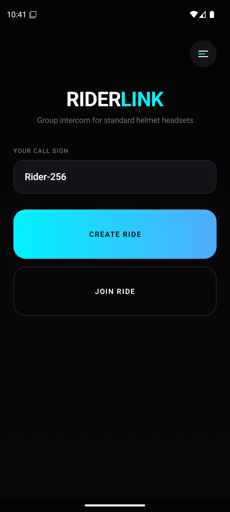
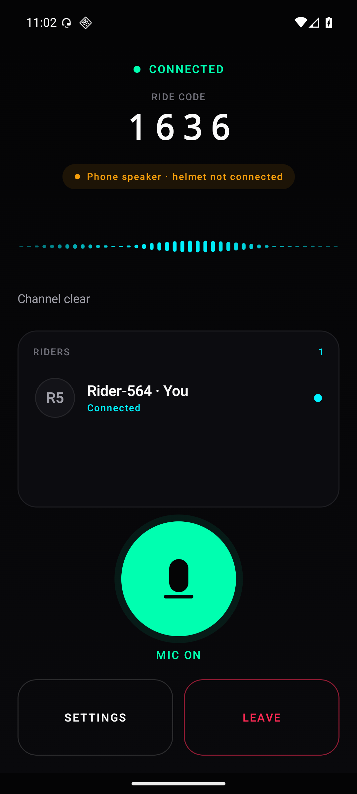
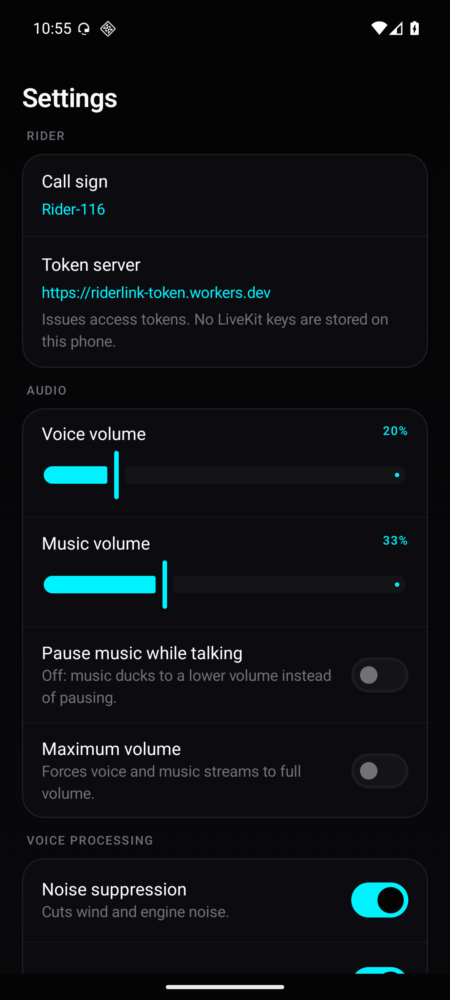

# RiderLink 🏍️

Group voice intercom for motorcyclists, built for the plain Bluetooth headset
already in your helmet.

Mesh intercom hardware from Sena or Cardo costs more than most riders want to
spend and only talks to its own brand. RiderLink carries the same conversation
over LiveKit/WebRTC on mobile data instead, so a group can ride together on
whatever headsets they happen to own, at whatever distance mobile coverage
reaches.

<p align="center">
  
  
  
</p>

---

## Features

* **Group voice intercom** over LiveKit/WebRTC. Riders share a 4-digit ride code.
* **Standard Bluetooth helmet headsets.** Audio is routed to the headset as a
  communication device; the dashboard says plainly when it is not, because a
  silent intercom and a misrouted one look identical from the saddle.
* **Runs in your pocket.** A foreground microphone service keeps the ride alive
  with the screen off.
* **Music keeps playing.** RiderLink takes ducking audio focus, so your music
  drops in volume while someone talks and comes back afterwards. It can pause
  instead, if you prefer.
* **Helmet button gestures.** Triple-press play/pause to mute, double long-press
  volume up for a private channel, volume down to return to the group — with
  spoken confirmation, so you never look down.
* **Private rider channels.** Isolate one rider's audio, from the roster or from
  a helmet button.
* **Live rider roster.** Who is connected, who is speaking, who is muted.
* **Reconnection that survives tunnels.** Exponential backoff with jitter,
  waiting on the radio rather than retrying into a dead one, and bounded so a
  lost ride cannot hold your CPU awake indefinitely.
* **Glove-friendly.** Every primary control is at least 88dp; the microphone
  button is 132dp.

---

## Architecture

```text
┌──────────────────────────── Android client ───────────────────────────┐
│                                                                        │
│  Jetpack Compose                                                       │
│    Lobby · Ride dashboard · Settings                                   │
│         │                                                              │
│  MainViewModel  ── binds ──┐                                           │
│         │                  │                                           │
│  domain/model              │     IntercomService (foreground)          │
│    ConnectionStatus        └───▶   owns the ride, fetches its own      │
│    Rider / RiderState              tokens, supervises reconnection,    │
│    AudioRoute                      MediaSession, TTS, wakelock         │
│    ReconnectPolicy                        │                            │
│                                           ├── LiveKitIntercomClient    │
│                                           ├── BluetoothAudioRouter     │
│                                           └── NetworkMonitor           │
└────────────────────────────────────────────┬───────────────────────────┘
                                             │
                  ┌──────────────────────────┼──────────────────────────┐
                  ▼                          ▼                          ▼
        Token server (Worker)         LiveKit Cloud              Firestore
        mints room-scoped,            WebRTC voice room          4-digit ride
        short-lived tokens                                       code registry
```

Three deliberate boundaries:

**The app holds no LiveKit credentials.** Signing an access token needs the
LiveKit API secret, and anything compiled into an APK is readable by anyone
holding the APK. A Cloudflare Worker signs tokens instead and hands back tokens
scoped to one room. See [`server/README.md`](server/README.md).

**The service owns the ride, not the ViewModel.** The service outlives the
Activity, so it is the only component that can re-authenticate and rebuild a
session that drops halfway through a ride.

**Connection state is a domain type, not LiveKit's.** `ConnectionStatus` is
separate from `Room.State` so the dashboard cannot report CONNECTED because a
room object happens to exist.

---

## Getting started

### Requirements

| | |
|---|---|
| Android | 8.0 (API 26) or newer |
| Build JDK | 21+ |
| Android SDK | Platform 36, Build-Tools 36.1.0 |
| Accounts | LiveKit Cloud (or self-hosted), Firebase, Cloudflare |

### 1. Deploy the token server first

The app cannot connect without one — it has no credentials of its own.

```bash
cd server
npm install
npx wrangler login
npx wrangler secret put LIVEKIT_API_KEY
npx wrangler secret put LIVEKIT_API_SECRET
# set LIVEKIT_URL in wrangler.toml to your wss:// address
npx wrangler deploy
```

Put the printed URL into `DEFAULT_TOKEN_SERVER_URL` in
`app/src/main/java/com/example/riderlink/Config.kt`, or set it per-device under
Settings → Token server.

### 2. Firebase

Drop your own `app/google-services.json` in place, then publish the rules:

```bash
firebase deploy --only firestore:rules
```

Firestore only records that a 4-digit code is in use. It holds no credentials,
and an unreachable directory does not ground a ride: the token server is what
actually controls access.

### 3. Build

```bash
./gradlew assembleDebug                     # debug APK
./gradlew testDebugUnitTest                 # unit tests
./gradlew assembleRelease                   # signed release APK
```

### 4. Release signing

Generate a keystore outside the repository and point a gitignored
`keystore.properties` at it:

```bash
keytool -genkeypair -v \
  -keystore ~/.riderlink/riderlink-release.jks \
  -alias riderlink -keyalg RSA -keysize 4096 -validity 10000

cat > keystore.properties <<EOF
storeFile=$HOME/.riderlink/riderlink-release.jks
storePassword=<your password>
keyAlias=riderlink
keyPassword=<your password>
EOF
```

CI can supply `RIDERLINK_STORE_FILE`, `RIDERLINK_STORE_PASSWORD`,
`RIDERLINK_KEY_ALIAS` and `RIDERLINK_KEY_PASSWORD` instead. With neither
present the release build is left unsigned rather than silently falling back to
the debug key.

**Never commit the keystore or its passwords.** Both are gitignored.

### 5. Install

```bash
adb install -r app/build/outputs/apk/release/app-release.apk
```

Install on two phones to try a real two-rider ride.

---

## Local development without deploying anything

Run LiveKit and the token server on your own machine:

```bash
livekit-server --dev          # devkey / secret, ws://localhost:7880
node server/dev-local.mjs     # same Worker handler, on :8787
```

Then set Settings → Token server to `http://10.0.2.2:8787` on an emulator, or
your machine's LAN address on a physical device. Debug builds permit cleartext
to those hosts only; release builds stay HTTPS/WSS-only.

---

## Permissions

| Permission | Why |
|---|---|
| `RECORD_AUDIO` | Carrying your voice. |
| `BLUETOOTH_CONNECT` | Finding and routing to the helmet headset. |
| `INTERNET`, `ACCESS_NETWORK_STATE` | The voice room, and knowing when the radio drops. |
| `MODIFY_AUDIO_SETTINGS` | Audio mode, routing and music ducking. |
| `FOREGROUND_SERVICE`, `FOREGROUND_SERVICE_MICROPHONE` | Staying live with the screen off. |
| `WAKE_LOCK` | Keeping the CPU up for audio during doze. |
| `POST_NOTIFICATIONS` | The ongoing ride notification. Optional; declining does not block the intercom. |

Notification access is requested separately from Settings. It is what lets
RiderLink see your headset's media keys and read the current track, and the
helmet gestures do not work without it.

The LiveKit SDK also declares `CAMERA` and `FOREGROUND_SERVICE_MEDIA_PROJECTION`
because it supports video. Both are stripped from the merged manifest — a
motorcycle intercom has no business asking for the camera.

---

## Known limitations

* **R8 is off for release builds.** LiveKit and Firebase both resolve classes
  reflectively, and a shrunk build that has not been ridden with is a poor
  trade. Turning it on needs a tested keep-rule set.
* **The token server has no rate limiting or caller identity.** Anyone who knows
  the URL can request a token for any 4-digit code. Adding Firebase Auth
  verification and a rate-limit binding is the next step; see
  [`server/README.md`](server/README.md).
* **Ride codes are 4 digits and never expire.** That is 9,000 codes with no
  cleanup. Fine for friends; not enough for strangers.
* **Tokens last 12 hours.** LiveKit needs a valid token to re-establish a
  dropped link, and the app does not yet refresh on reconnect, so the TTL has to
  outlast a full day's ride.
* **No PTT.** The intercom is always open while unmuted.

---

## Licence

No licence has been chosen yet, so default copyright applies.
